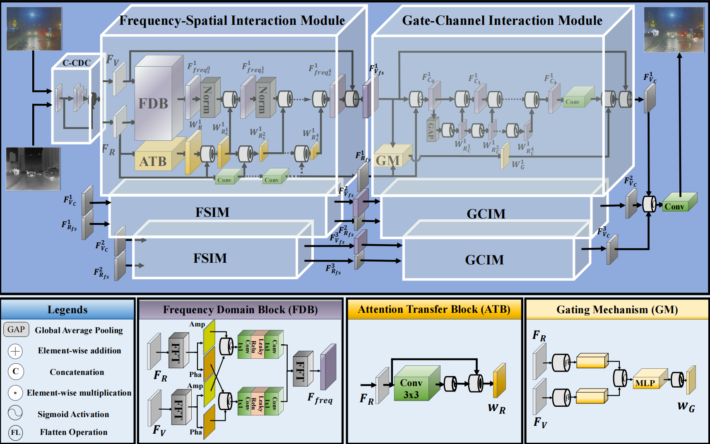
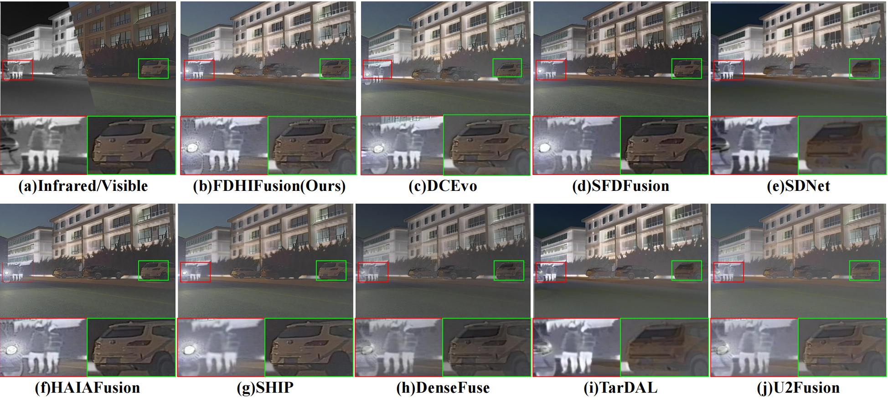
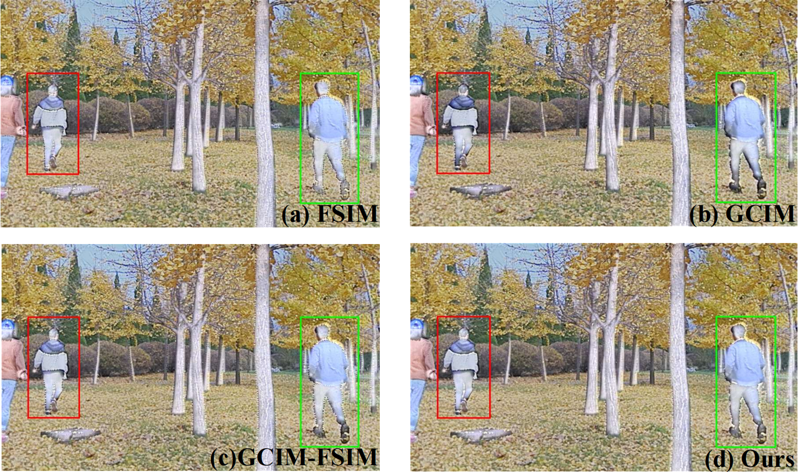

# :dizzy:FDHIFusion: A Frequency Domain High-order Interaction Network for Infrared and Visible Image Fusion

***

This code is a **pytorch** implementation of our paper "**FDHIFusion: A Frequency Domain High-order Interaction Network for Infrared and Visible Image Fusion**".

***

## :boom:Primary contributions

***

To address the identified challenges, we propose the **Frequency Domain High-order Interaction Fusion (FDHIFusion)** network, which enhances existing frameworks by **improving both spatial and channel interactions.** Our contributions are as follows: 

1.🌏We introduce FDHIFusion, a network for infrared and visible image fusion, which explores **the high-order interactions among features** and fully exploits **the feature expression capability** of **frequency domain information**.

2.🌏We propose **a novel Frequency-Spatial Interaction Module (FSIM)** that thoroughly **extracts global information** from features in the frequency domain, **dynamically guiding feature aggregation** through a specialized attention module capable of perceiving long-range dependencies.

3.🌏We implement **Gating Mechainism (GM)** to manage feature score allocation in channel interactions within the **Gate-Channel Interaction Module (GCIM)**, effectively **preventing the loss of positive features**.

4.🌏Experiments on Infrared and Visible Image Fusion demonstrate our algorithm outperforms current state-of-the-art methods, excelling in producing fused images with fine textures, enhanced contrast, **better alignment with human visual perception**, **improved preservation of thermal information from source images**, and **excellent performance in downstream tasks**.

***

## :computer:Proposed method
***

The proposed FDHIFusion framewframeork with two components: FSIM and GCIM.
***
## :triangular_flag_on_post:Comparison
***
#### - Qualitative Results on M3FD

#### - Quantitative results on M3FD

| Methods      | EN↑  | MI↑  | SF↑  | AG↑  | VIF↑ | Qabf↑ |
|--------------|------|------|------|------|------|-------|
| U2Fusion  | 6.653 | 2.839 | 9.008 | 3.105 | 0.613 | 0.468 |
| Densefuse | 6.648 | 2.838 | 8.777 | 3.048 | 0.632 | 0.449 |
| SDNet     | 6.533 | 3.026 | 10.31 | 3.623 | 0.678 | 0.406 |
| TarDal    | 6.817 | 3.786 | 12.56 | 4.148 | 0.581 | 0.409 |
| SFDFusion | 6.809 | 3.815 | 14.78 | 4.967 | 0.556 | 0.478 |
| SHIP      | 6.859 | 4.845 | 14.76 | 4.942 | 0.801 | 0.628 |
| HAIAFusion | 6.855 | 4.963 | 14.30 | 4.725 | 0.806 | 0.614 |
| DCEvo     | 6.842 | 4.436 | 13.488 | 4.381 | 0.766 | 0.607 |
| **FDHFusion (Ours)** | **6.894** | **5.020** | **14.91** | **5.016** | **0.807** | **0.636** |

#### - Quantitative results on RoadScene

| Methods      | EN↑   | MI↑   | SF↑   | AG↑   | VIF↑  | Qabf↑ |
|--------------|-------|-------|-------|-------|-------|-------|
| U2Fusion     | 7.029 | 2.628 | 13.95 | 5.586 | 0.559 | 0.501 |
| Densefuse    | 7.208 | 2.870 | 12.29 | 4.796 | 0.585 | 0.470 |
| SDNet        | 7.262 | 3.421 | 15.71 | 6.140 | 0.656 | 0.559 |
| TarDal       | 7.196 | 3.247 | 10.45 | 4.259 | 0.553 | 0.403 |
| SFDFusion    | 7.246 | 3.982 | 14.89 | 6.045 | 0.660 | 0.472 |
| SHIP         | 7.213 | 3.960 | 17.11 | 6.439 | 0.690 | 0.572 |
| HAIAFusion   | 7.211 | 3.349 | 17.04 | 6.240 | 0.604 | 0.534 |
| DCEvo        | 7.159 | 3.586 | 14.91 | 5.638 | 0.686 | 0.567 |
| **FDHFusion (Ours)** | **7.274** | **4.004** | **17.70** | **6.676** | **0.679** | **0.593** |

#### - Quantitative results on TNO

| Methods      | EN↓   | MI↑   | SF↑   | AG↑   | VIF↑  | Qabf↑ |
|--------------|-------|-------|-------|-------|-------|-------|
| U2Fusion     | 6.624 | 2.055 | 11.01 | 4.017 | 0.630 | 0.428 |
| Densefuse    | 6.696 | 2.676 | 9.490 | 3.720 | 0.564 | 0.366 |
| SDNet        | 6.623 | 2.824 | 9.184 | 3.352 | 0.402 | 0.383 |
| TarDal       | 6.679 | 3.216 | 10.69 | 3.826 | 0.565 | 0.386 |
| SFDFusion    | 6.741 | 2.828 | 10.75 | 4.043 | 0.594 | 0.386 |
| SHIP         | 6.667 | 4.054 | 11.09 | 4.168 | 0.761 | 0.536 |
| HAIAFusion   | 6.666 | 3.952 | 10.66 | 4.152 | 0.786 | 0.536 |
| DCEvo        | **6.849** | 3.690 | 10.46 | 3.831 | 0.776 | **0.545** |
| **FDHFusion (Ours)** | 6.763 | **4.199** | **11.13** | **4.201** | **0.786** | 0.543 |
***
## :book:Ablation study

#### - Qualitative results on Analysis of the High-order Interaction modules.

FSIM and GCIM represent individual interaction modules, respectively. The notation GCIM->FSIM indicates a serial structure with the order reversed.
***
## :gear:Pre-requisties

<ul>
<li> Linux
<li> python> =3.8
<li> Cuda 11.8
</ul>

***
## :open_file_folder:Datasets

The M3FD dataset with mask can be downloaded at https://drive.google.com/drive/folders/1J15Kt8hiwDoB24FEMPKiofn_4dD0tpFz?usp=drive_link.

***
## 🫳Install dependencies

    pip install -r requirements.txt

***
## 🐎Training

if you want to train on your own datasets,you can use vsm.m to generate mask for training. Please run the following command to train:

    python train.py -opt train.yml

***
## 🔍Test

You can run the follow command for testing:

    python test.py -opt test.yml

